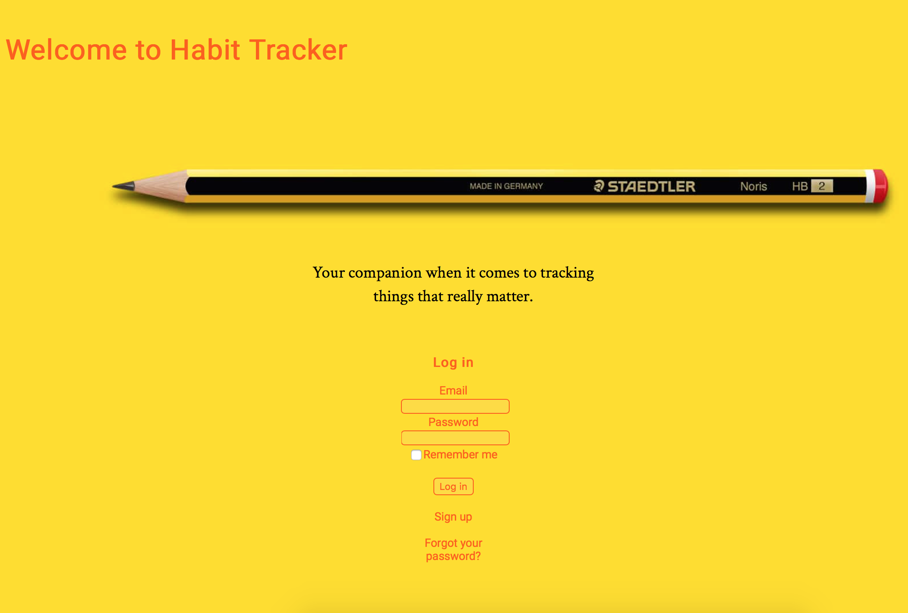

## Summary

Habit tracker is a full stack application created to keep track of everyday habits. Registered users can create new habits to track, set goals, make inputs about occurrences of the tracked habits, and see the display of it all in the form of a graph. Deployed version can be found at: https://ante-habit-tracker.herokuapp.com/users/sign_in

## User Stories

In order to use this app, users must register with their email accounts. After that, they can start creating habits they want to track. Under each created habit, a user can make input about occurrences and see how often tracked event took place.

## Application Preview

## Technologies Used

The application is built using Ruby on Rails and MySQL DB to preserve data. For user authentication 
I used Devise gem and graphical display of data is rendered with the help of Kickchart gem. 
The application is deployed on Heroku.

## Unsolved problems

In the future, I would like to add email verification and reminder option for the users
